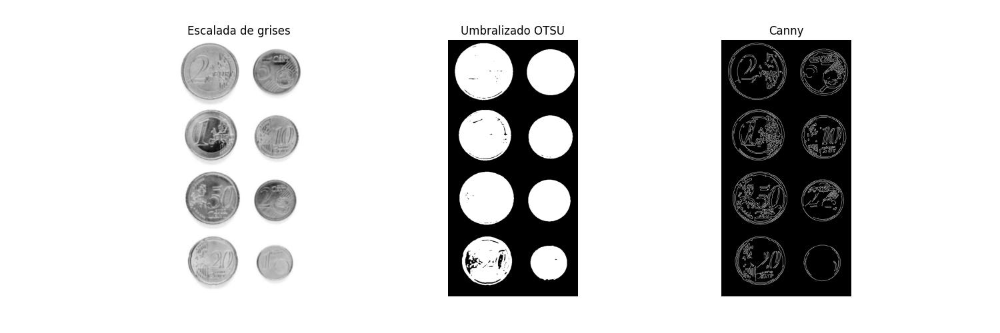

<h1 align="center">Práctica 3</h1>

<h2 align="center">Asignatura: Visión por Computador</h2>

Universidad de Las Palmas de Gran Canaria  
Escuela de Ingeniería en Informática  
Grado de Ingeniería Informática  
Curso 2025/2026 

<h2 align="center">Autores</h2>

- Asmae Ez Zaim Driouch
- Javier Castilla Moreno

<h2 align="center">Bibliotecas utilizadas</h2>

[](https://numpy.org/)
[](https://opencv.org/)
[](https://matplotlib.org/)
[](https://scikit-learn.org/)
[](https://rtree.readthedocs.io/)

## Cómo usar
### Primer paso: clonar este repositorio
```bash
git clone "https://github.com/Javier-Castilla/VC-P3"
```
### Segundo paso: Activar tu envinroment e instalar dependencias
> [!NOTE]
> Todas las dependencias pueden verse en [este archivo](envinronment.yml). Si se desea, puede crearse un entorno de Conda con dicho archivo.

Si se opta por crear un nuevo `Conda envinronment` a partir del archivo expuesto, es necesario abrir el `Anaconda Prompt` y ejecutar lo siguiente:

```bash
conda env create -f environment.yml
```

Posteriormente, se activa el entorno:

```bash
conda activate VC_P3
```

### Tercer paso: ejecutar el cuaderno
Finalmente, abriendo nuestro IDE favorito y teniendo instalado todo lo necesario para poder ejecutar notebooks, se puede ejecutar el cuaderno de la práctica [Practica3.ipynb](Practica3.ipynb) seleccionando el envinronment anteriormente creado.

> [!IMPORTANT]
> Todos los bloques de código deben ejecutarse en órden, de lo contrario, podría ocasionar problemas durante la ejecución del cuaderno.

<h1 align="center">Tareas</h1>

<h2 align="center">Tarea 1</h2>

En esta tarea se realizará un sistema que sea capaz de contar el dinero que hay en una imagen únicamente detectando las monedas que aparecen en ella para posteriormente, clasificar las detecciones asignándoles su valor monetario.

Para ello, nuestra técnica ha sido umbralizar la imagen para intentar separar las monedas del fondo, donde luego, se tratará de encontrar contornos exteriores y encerrarlos en una elipse. El motivo por el que hemos decidio usar una elipse es porque esta nos permite hacer un conteo correcto incluso cuando hay sombras presentes en la imagen, pues nos hemos percatado de que su eje menor coincidirá con el diámetro de la moneda aunque haya sombras en el umbralizado.

Con la imagen inicial propuesta, el resultado de la umbralización es el siguiente:

```python
image = cv2.imread("imgs/coins_v2.jpg", cv2.IMREAD_COLOR_RGB)

image_gray = cv2.cvtColor(image, cv2.COLOR_RGB2GRAY)
image_gray = cv2.GaussianBlur(image_gray, (5, 5), 2)

canny = cv2.Canny(image_gray, 50, 125)

_, threshold_image = cv2.threshold(image_gray, 0, 255, cv2.THRESH_BINARY_INV + cv2.THRESH_OTSU)
```



Como se puede observar en el resultado de aplicar Canny, los bordes de las monedas no se han cerrado correctamente, razón de más por la que hemos seguido la técnica de identificar contornos circulares.

Una vez se ha procesado la imagen para segmentar las monedas, se buscan sus contornos, filtrando aquellos que no cumplan un área mínima y que no son suficientemente circulares.

<table align="center">
    <tr align="center">
        <td align="center">
            <h3>Fórmula para la circularidad</h3>
            <code>C = 4π * (area / perimeter²)</code>
        </td>
    </tr>
</table>

> [!NOTE]
> Cuanto más se acerque a 1 el resultado de la circularidad, más circular será el contorno.

El método desarrollado para esta fin es el siguiente:

```python
def __find_circular_contours(self, image):
    contours, _ = cv2.findContours(
        image,
        cv2.RETR_EXTERNAL,
        cv2.CHAIN_APPROX_SIMPLE
    )

    contours = sorted(
        [c for c in contours if self.__calculate_circularity(c)],
        key=lambda c: cv2.contourArea(c), reverse=True
    )
    contours_ellipses = {}

    for i, c in enumerate(contours):
        ellipse = cv2.fitEllipse(c)
        contours_ellipses[i] = {
            'ellipse': ellipse,
            'center': ellipse[0],
            'width': min(ellipse[1]),
            'angle': ellipse[2]
        }
        
    return contours_ellipses
```

En este método, primero se obtienen los contornos exteriores haciendo uso de `cv2.findContours`, seleccionando los contornos externos con `cv2.RETR_EXTERNAL`. Posteriormente, mediante un `list comprehension` se usa el método `__calculate_circularity`, el cuál calculará la circularidad del contorno y servirá para discriminarlo o no teniendo en cuanta también su área. De este modo, solo nos quedamos con los contornos circulares lo suficientemente grandes.

> [!NOTE]
> Los contornos filtrados se han ordenado con la función nativa de python `sorted` con el fin de conseguir un mejor reconocimiento en las salidas del proceso y poder así corregir errores fácilmente.

El método correspondiente al cálculo de la circularidad y área mínima es el siguiente:

```python
def __calculate_circularity(self, contour):
    area = cv2.contourArea(contour)
    perimeter = cv2.arcLength(contour, True)

    if perimeter == 0:
        return False

    circularity = 4 * np.pi * (area / (perimeter * perimeter))
    return circularity >= 0.6 and area > 50
```

> [!NOTE]
> El motivo de elegir una elipse y no un círculo para encerrar el contorno, es porque el eje menor de la elipse coincidirá con el diámetro de la moneda sin tener en cuenta la sombra. De este modo, se evita detectar formas más grandes de las reales.

En este punto ya se ha procesado la imagen para segmentarla y se han encontrado contornos circulares que podrían asociarse a una moneda. Ahora solo falta seleccionar una moneda de referencia para obtener el ratio de píxel / milímetro con el fin de clasificar correctamente los contornos.

El modo de proceder ha sido sencillo, simplemente mostramos la imagen con los contornos dibujados encima y un índice. Posteriormente, se pide un `input` del índice de la moneda de 1€. Con esto, ya se puede calcular perfectamente el ratio.

```python
def show_detection_and_pick_coin(self, coin):
    self.selected_coin = coin
    drawed = self.__draw_found__ellipses_information()
    plt.imshow(drawed, cmap='gray')
    plt.axis('off')
    plt.show()
    self.selected_index = input(f"Selecciona el índice de la moneda con valor {coin}")
    return drawed, self.selected_index
```


Tras todo esto, se ha segmentado la imagen, se han detectado contornos circulares, se ha calculado el ratio a partir de la selección del usuario como moneda de 1€ o como moneda que haya elegido. Ahora... `let's do the math!` ( hacer el conteo ). Para ello, se ha declarado en un diccionario los diámetros de cada moneda con su respectivo valor monetario en céntimos para evitar errores por `float`. Seguidamente, para cada contorno, se coge el diámetro del diccionario nombrado que tenga menor error con el eje menor de dicho contorno y se añade su valor al contador.

> [!NOTE]
> El eje menor de la elipse de cada contorno es dividido entre el ratio calculado anteriormente para obtener los milímetros de dicho eje.

```python
def do_the_math(self, debug):
    if len(self.ellipses) == 0:
        print('No se han encontrado figuras suficientes para hacer las mates.')
        return

    self.PIXEL_MM_RATIO = self.ellipses[int(self.selected_index)]['width'] / MoneyCounter.coins_d['100']

    current = []

    for c in self.ellipses.values():
        r = c['width']
        d = r / self.PIXEL_MM_RATIO
        k = min(MoneyCounter.coins_invert, key=lambda k: abs(k - d))
        current.append(Coin(MoneyCounter.coins_invert[k], k))

    debugged = {}

    if debug:
        debugged['original'] = cv2.cvtColor(self.image.copy(), cv2.COLOR_BGR2RGB)
        debugged['threshold'] = self.thresh_image
        debugged['contours'] = self.__draw_found_ellipses_information_upon_empty_canvas()
        debugged['money'] = sum(current).amount()

    return sum(current), current, debugged
```

> [!NOTE]
> El método que realiza el conteo devuelve la suma total del dinero y las monedas seleccionadas para cada contorno detectado. Además, si se activa el modo `debug`, es posible obtener también todo el proceso de la detección de las monedas.

Cabe destacar que se ha realizado el siguiente modelo para una representación más clara de los resultados:

```python
from dataclasses import dataclass

@dataclass
class Coin:
    value: int
    diameter: float
    
    def __add__(self, other):
        if isinstance(other, Coin):
            return Money(self.value + other.value)
        elif isinstance(other, Money):
            return Money(self.value + other.value)
        return NotImplemented

    def __radd__(self, other):
        if other == 0:
            return Money(self.value)
        elif isinstance(other, Money):
            return Money(self.value + other.value)
        return NotImplemented
            

@dataclass
class Money:
    value: int

    def amount(self):
        return self.value / 100
```

> [!IMPORTANT]
> Aunque el usuario pueda seleccionar el valor de la moneda que quiere coger como referencia, tras varias pruebas se ha observado que generalmente, el sistema funciona mucho mejor si dicha moneda es la de 1€.

Todo lo anteriormente nombrado han sido métodos desarrollados dentro de una clase cuyo motivo de existencia es la realización de pruebas mediante el mismo método de conteo en diferentes imágenes. El flujo a seguir para hacer el conteo es el siguiente:
1. Instanciar la clase con la imagen seleccionada.
2. Se usa el método para mostrar las detecciones y seleccionar la moneda que correspondería con la de 1€ o con la introducida por el usuario.
3. Se hace el conteo usando el método desarrollado, obteniendo el resultado y las imágenes de todo el proceso realizado si se selecciona la opción `debug`

Seguidamente se muestra un ejemplo de su uso:

```python
monedas = MoneyCounter('imgs/Monedas.jpg')
result, selected = monedas.show_detection_and_pick_coin(1)
count, coins, d_monedas = monedas.do_the_math(True)
print(count, coins, d_monedas)
```

Esta sería la salida que se obtendría con el código anterior:

```python
```

A continuación, se muestran los resultados obtenidos para cada una de las imágenes seleccionadas, además de la propuesta inicialmente.

> [!NOTE]
> La clase desarrollada puede verse en el cuaderno de Python [Practica3.ipynb](Practica3.ipynb#clase-desarrollada-para-el-conteo).

<table align="center">
    <tr align="center">
        <td>
            <h3 align="center">Monedas.jpg</h3>
            
            <div>
                <h4>Resultado obtenido: 3.88€</h4>
            </div>
        </td>
        <td>
            <h3 align="center">coins_with_shadow.jpg</h3>
            
            <div>
                <h4>Resultado obtenido: 3.88€</h4>
            </div>
        </td>
    </tr>
    <tr align="center">
        <td>
            <h3 align="center">coins_v2.jpg</h3>
            
            <div>
                <h4>Resultado obtenido: 8€</h4>
            </div>
        </td>
        <td>
            <h3 align="center">coins_v3.jpg</h3>
            
            <div>
                <h4>Resultado obtenido: 3.88€</h4>
            </div>
        </td>
    </tr>
</table>

> [!IMPORTANT]
> Hay que tener el cuenta que las imágenes usadas han tenido bastante buena calidad. Este sistema empieza a fallar cuando el umbralizado no es suficiente para separar bien las monedas del fondo por ejemplo, cuando el color del fondo es muy parecido al de las monedas o estas tienen brillos irregulares o incluso deformaciones por la lente de la cámara.

<h3 align="center">Consideraciones a tener en cuenta</h3>

Cabe destacar que se ha hecho uso de la `detección de contornos` para segmentar las monedas debido a que, tras varias pruebas realizadas, aunque en algunos casos la `Transformada de Hough` para detectar figuras circulares lograba encontrar las monedas en la imagen, en muchos otros, sobre todo cuando aparecían texturas o sombras, tenía un peor rendimiento.

<h2 align="center">Tarea 2</h2>

Para la realización de esta tarea se extraerán características geométricas y visuales de los diferentes tipos de microplásticos para posteriormente. Posteriormetne, se usarán esas características extraídas tratando de clasificar correctamente las 3 clases de microplásticos diferentes sobre la imagen [MPs_test.png](imgs/MPs_test.png).

Para lograr este objetivo, se han realizado los siguientes procedimientos:
1. Uso de un conjunto de 3 imágenes, una para cada clase.
2. Segmentación de cada imagen para la extracción de contornos.
3. Tratamiento de los contornos extraídos, obteniendo características de cada uno de ellos.
4. Estandarizado de los valores de las características.
5. Introducción de características en el clasificador RandomForest.
6. Repetición de los puntos del 2 al 4 para la imagen de test.
7. Clasficación de los contornos detectados en la imagen de test.
8. Evaluación de resultados.

<h3 align="center">Segmentación y extracción de contornos</h3>

El proceso de segmentación se ha ido modificando a lo largo de la realización de esta tarea. Esto ha sido impulsado por un descontento inicial con los resultados obtenidos las primeras veces, pues notamos que realmente se debía a una segmentación algo pobre de las imágenes iniciales sobre las que se extraerían las características.

En los primeros pasos, se usaba una segmentación simple mediante un umbralizado recurriendo a la función `cv2.threshold` con OTSU. En la mayoría de contornos funcionaba bien, pero cuando aparecían microplásticos con un color muy parecido al fondo, esta técnica de segmentación fallaba.


Posteriormente, decidimos usar el `umbralizado adaptativo Gaussiano`. Parecía dar mejores resultados, pero el desenfoque en las imágenes iniciales provocaba la presencia de demasiado ruido en la detección de contornos, por lo que decidimos aplicar la función `cv2.medianBlur` con buenos resultados.


En este punto los resultados de la clasificación mejoraron bastante. Se incrementó la precisión `de un 52% a un 67%`, pero creímos que no era suficiente. Por ello, decidimos hacer una combinación de las dos técnicas de segmentación que habíamos planteado junto con una `dilatación de bordes`. Este enlace permitía rellenar en la umbralización Gaussiana aquellos bordes que sí pudieron ser detectados con el umbralzado, es decir, ambos umbralizados se complementaban, y es ahí donde el filtrado de mediana nos sirvió de gran ayuda, pues el umbralizado adaptativo como bien se explicó anteriormente producía mucho ruido, pero el filtro de mediana consiguió eliminar prácticamente la totalidad de este.


<h3 align="center">Filtrado de contornos y extracción de características</h3>

Ya hemos conseguido segmentar muy bien las partículas de las 3 imágenes usadas para extraer características. Ahora, era necesario filtrar algunos contornos que podrían ser pequeñas manchas en la imagen. Para lograr esto, se usó un método estadístico estudiado en cursos anteriores, la `eliminación de outliers`. Además, se propuso un área mínima de contorno, descartando todos aquellos que no la superasen.

> [!NOTE]
> Concretamente, la eliminación de outliers consiste en descartar todos aquellos que estén por encima del percentil 100 y por encima del percentil 75.

<h3 align="center">Estandarizado de valores</h3>

<h3 align="center">Introducción de características en el clasificador RandomForest</h3>

<h3 align="center">Imagen de test para la clasificación</h3>

<h3 align="center">Evaluación de resultados</h3>

- [Repositorio usado como base y enuneciado de esta práctica](https://github.com/otsedom/otsedom.github.io/tree/main/VC/P3)
- [Fit Ellipse de CV2](https://docs.opencv.org/4.x/de/d62/tutorial_bounding_rotated_ellipses.html)
- [Circularidad](https://imagej.net/ij/plugins/circularity.html)
- [Dilatación para tratar de cerrar bordes](https://pythongeeks.org/dilation-and-erosion-in-opencv/)
- [Clasificador RandomForest basado en árboles de decisión](https://scikit-learn.org/stable/modules/generated/sklearn.ensemble.RandomForestClassifier.html)
- [RTree para optimización de búsquedas](https://scikit-learn.org/stable/modules/generated/sklearn.ensemble.RandomForestClassifier.html)
- [Estandarizador de valores](https://scikit-learn.org/stable/modules/generated/sklearn.preprocessing.StandardScaler.html)