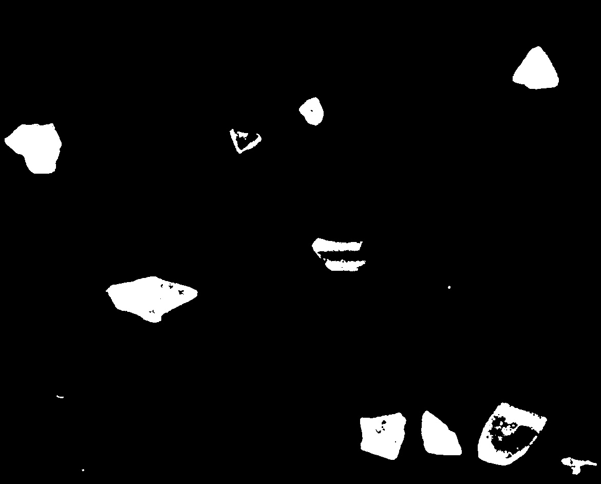

<h1 align="center">Práctica 3</h1>

<h2 align="center">Asignatura: Visión por Computador</h2>

Universidad de Las Palmas de Gran Canaria  
Escuela de Ingeniería en Informática  
Grado de Ingeniería Informática  
Curso 2025/2026 

<h2 align="center">Autores</h2>

- Asmae Ez Zaim Driouch
- Javier Castilla Moreno

<h2 align="center">Bibliotecas utilizadas</h2>

[](https://numpy.org/)
[](https://opencv.org/)
[](https://matplotlib.org/)
[](https://scikit-learn.org/)
[](https://rtree.readthedocs.io/)

## Cómo usar
### Primer paso: clonar este repositorio
```bash
git clone "https://github.com/Javier-Castilla/VC-P3"
```
### Segundo paso: Activar tu envinroment e instalar dependencias
> [!NOTE]
> Todas las dependencias pueden verse en [este archivo](environment.yml). Si se desea, puede crearse un entorno de Conda con dicho archivo.

Si se opta por crear un nuevo `Conda environment` a partir del archivo expuesto, es necesario abrir el `Anaconda Prompt` y ejecutar lo siguiente:

```bash
conda env create -f environment.yml
```

Posteriormente, se activa el entorno:

```bash
conda activate VC_P3
```

### Tercer paso: ejecutar el cuaderno
Finalmente, abriendo nuestro IDE favorito y teniendo instalado todo lo necesario para poder ejecutar notebooks, se puede ejecutar el cuaderno de la práctica [Practica3.ipynb](Practica3.ipynb) seleccionando el environment anteriormente creado.

> [!IMPORTANT]
> Todos los bloques de código deben ejecutarse en órden, de lo contrario, podría ocasionar problemas durante la ejecución del cuaderno.

<h1 align="center">Tareas</h1>

<h2 align="center">Tarea 1</h2>

En esta tarea se realizará un sistema que sea capaz de contar el dinero que hay en una imagen únicamente detectando las monedas que aparecen en ella para posteriormente, clasificar las detecciones asignándoles su valor monetario.

Para ello, nuestra técnica ha sido umbralizar la imagen para intentar separar las monedas del fondo, donde luego, se tratará de encontrar contornos exteriores y encerrarlos en una elipse. El motivo por el que hemos decidio usar una elipse es porque esta nos permite hacer un conteo correcto incluso cuando hay sombras presentes en la imagen, pues nos hemos percatado de que su eje menor coincidirá con el diámetro de la moneda aunque haya sombras en el umbralizado.

Con la imagen inicial propuesta, el resultado de la umbralización es el siguiente:

```python
image = cv2.imread("imgs/coins_v2.jpg", cv2.IMREAD_COLOR_RGB)

image_gray = cv2.cvtColor(image, cv2.COLOR_RGB2GRAY)
image_gray = cv2.GaussianBlur(image_gray, (5, 5), 2)

canny = cv2.Canny(image_gray, 50, 125)

_, threshold_image = cv2.threshold(image_gray, 0, 255, cv2.THRESH_BINARY_INV + cv2.THRESH_OTSU)
```


Como se puede observar en el resultado de aplicar Canny, los bordes de las monedas no se han cerrado correctamente, razón de más por la que hemos seguido la técnica de identificar contornos circulares.

Una vez se ha procesado la imagen para segmentar las monedas, se buscan sus contornos, filtrando aquellos que no cumplan un área mínima y que no son suficientemente circulares.

<table align="center">
    <tr align="center">
        <td align="center">
            <h3>Fórmula para la circularidad</h3>
            <code>C = 4π * (area / perimeter²)</code>
        </td>
    </tr>
</table>

> [!NOTE]
> Cuanto más se acerque a 1 el resultado de la circularidad, más circular será el contorno.

El método desarrollado para esta fin es el siguiente:

```python
def __find_circular_contours(self, image):
    contours, _ = cv2.findContours(
        image,
        cv2.RETR_EXTERNAL,
        cv2.CHAIN_APPROX_SIMPLE
    )

    contours = sorted(
        [c for c in contours if self.__calculate_circularity(c)],
        key=lambda c: cv2.contourArea(c), reverse=True
    )
    contours_ellipses = {}

    for i, c in enumerate(contours):
        ellipse = cv2.fitEllipse(c)
        contours_ellipses[i] = {
            'ellipse': ellipse,
            'center': ellipse[0],
            'width': min(ellipse[1]),
            'angle': ellipse[2]
        }
        
    return contours_ellipses
```

En este método, primero se obtienen los contornos exteriores haciendo uso de `cv2.findContours`, seleccionando los contornos externos con `cv2.RETR_EXTERNAL`. Posteriormente, mediante un `list comprehension` se usa el método `__calculate_circularity`, el cuál calculará la circularidad del contorno y servirá para discriminarlo o no teniendo en cuanta también su área. De este modo, solo nos quedamos con los contornos circulares lo suficientemente grandes.

> [!NOTE]
> Los contornos filtrados se han ordenado con la función nativa de python `sorted` con el fin de conseguir un mejor reconocimiento en las salidas del proceso y poder así corregir errores fácilmente.

El método correspondiente al cálculo de la circularidad y área mínima es el siguiente:

```python
def __calculate_circularity(self, contour):
    area = cv2.contourArea(contour)
    perimeter = cv2.arcLength(contour, True)

    if perimeter == 0:
        return False

    circularity = 4 * np.pi * (area / (perimeter * perimeter))
    return circularity >= 0.6 and area > 50
```

> [!NOTE]
> El motivo de elegir una elipse y no un círculo para encerrar el contorno, es porque el eje menor de la elipse coincidirá con el diámetro de la moneda sin tener en cuenta la sombra. De este modo, se evita detectar formas más grandes de las reales.

En este punto ya se ha procesado la imagen para segmentarla y se han encontrado contornos circulares que podrían asociarse a una moneda. Ahora solo falta seleccionar una moneda de referencia para obtener el ratio de píxel / milímetro con el fin de clasificar correctamente los contornos.

El modo de proceder ha sido sencillo, simplemente mostramos la imagen con los contornos dibujados encima y un índice. Posteriormente, se pide un `input` del índice de la moneda de 1€. Con esto, ya se puede calcular perfectamente el ratio.

```python
def show_detection_and_pick_coin(self, coin):
    self.selected_coin = coin
    drawed = self.__draw_found__ellipses_information()
    plt.imshow(drawed, cmap='gray')
    plt.axis('off')
    plt.show()
    self.selected_coin = input("Introduce el valor de la moneda de referencia en céntimos")
    self.selected_index = input(f"Selecciona el índice de la moneda con valor {coin}")
    return drawed, self.selected_index
```


Tras todo esto, se ha segmentado la imagen, se han detectado contornos circulares, se ha calculado el ratio a partir de la selección del usuario como moneda de 1€ o como moneda que haya elegido. Ahora... `let's do the math!` ( hacer el conteo ). Para ello, se ha declarado en un diccionario los diámetros de cada moneda con su respectivo valor monetario en céntimos para evitar errores por `float`. Seguidamente, para cada contorno, se coge el diámetro del diccionario nombrado que tenga menor error con el eje menor de dicho contorno y se añade su valor al contador.

> [!NOTE]
> El eje menor de la elipse de cada contorno es dividido entre el ratio calculado anteriormente para obtener los milímetros de dicho eje.

```python
def do_the_math(self, debug):
    if len(self.ellipses) == 0:
        print('No se han encontrado figuras suficientes para hacer las mates.')
        return

    self.PIXEL_MM_RATIO = self.ellipses[int(self.selected_index)]['width'] / MoneyCounter.coins_d[self.selected_coin]

    current = []

    for c in self.ellipses.values():
        r = c['width']
        d = r / self.PIXEL_MM_RATIO
        k = min(MoneyCounter.coins_invert, key=lambda k: abs(k - d))
        current.append(Coin(MoneyCounter.coins_invert[k], k))

    debugged = {}

    if debug:
        debugged['original'] = cv2.cvtColor(self.image.copy(), cv2.COLOR_BGR2RGB)
        debugged['threshold'] = self.thresh_image
        debugged['contours'] = self.__draw_found_ellipses_information_upon_empty_canvas()
        debugged['money'] = sum(current).amount()

    return sum(current), current, debugged
```

> [!NOTE]
> El método que realiza el conteo devuelve la suma total del dinero y las monedas seleccionadas para cada contorno detectado. Además, si se activa el modo `debug`, es posible obtener también todo el proceso de la detección de las monedas.

Cabe destacar que se ha realizado el siguiente modelo para una representación más clara de los resultados:

```python
@dataclass
class Coin:
    value: int
    diameter: float
    
    def __add__(self, other):
        if isinstance(other, Coin):
            return Money(self.value + other.value)
        elif isinstance(other, Money):
            return Money(self.value + other.value)
        return NotImplemented

    def __radd__(self, other):
        if other == 0:
            return Money(self.value)
        elif isinstance(other, Money):
            return Money(self.value + other.value)
        return NotImplemented
            

@dataclass
class Money:
    value: int

    def amount(self):
        return self.value / 100
```

> [!IMPORTANT]
> Aunque el usuario pueda seleccionar el valor de la moneda que quiere coger como referencia, tras varias pruebas se ha observado que generalmente, el sistema funciona mucho mejor si dicha moneda es la de 1€.

Todo lo anteriormente nombrado han sido métodos desarrollados dentro de una clase cuyo motivo de existencia es la realización de pruebas mediante el mismo método de conteo en diferentes imágenes. El flujo a seguir para hacer el conteo es el siguiente:
1. Instanciar la clase con la imagen seleccionada.
2. Se usa el método para mostrar las detecciones y seleccionar la moneda que correspondería con la de 1€ o con la introducida por el usuario.
3. Se hace el conteo usando el método desarrollado, obteniendo el resultado y las imágenes de todo el proceso realizado si se selecciona la opción `debug`

Seguidamente se muestra un ejemplo de su uso:

```python
monedas = MoneyCounter('imgs/Monedas.jpg')
result, selected = monedas.show_detection_and_pick_coin(1)
count, coins, d_monedas = monedas.do_the_math(True)
print(count, coins, d_monedas)
```

Esta sería la salida que se obtendría con el código anterior:

```
Money(value=388) [Coin(value=200, diameter=25.75), Coin(value=50, diameter=24.25), Coin(value=100, diameter=23.25), Coin(value=20, diameter=22.25), Coin(value=5, diameter=21.25), Coin(value=10, diameter=19.75), Coin(value=2, diameter=18.75), Coin(value=1, diameter=16.25)] {'original': array([[[255, 255, 255],
        [255, 255, 255],
        [255, 255, 255],
        ...,
        [255, 255, 255],
        [255, 255, 255],
        [255, 255, 255]],

       [[255, 255, 255],
        [255, 255, 255],
        [255, 255, 255],
        ...,
        [255, 255, 255],
        [255, 255, 255],
        [255, 255, 255]],

       [[255, 255, 255],
        [255, 255, 255],
        [255, 255, 255],
        ...,
        [255, 255, 255],
        [255, 255, 255],
        [255, 255, 255]],

       ...,
```

A continuación, se muestran los resultados obtenidos para cada una de las imágenes seleccionadas, además de la propuesta inicialmente.

> [!NOTE]
> La clase desarrollada puede verse en el cuaderno de Python [Practica3.ipynb](Practica3.ipynb#clase-desarrollada-para-el-conteo).

<table align="center">
    <tr align="center">
        <td>
            <h3 align="center">Monedas.jpg</h3>
            
            <div>
                <h4>Resultado obtenido: 3.88€</h4>
            </div>
        </td>
        <td>
            <h3 align="center">coins_with_shadow.jpg</h3>
            
            <div>
                <h4>Resultado obtenido: 3.88€</h4>
            </div>
        </td>
    </tr>
    <tr align="center">
        <td>
            <h3 align="center">coins_v2.jpg</h3>
            
            <div>
                <h4>Resultado obtenido: 8€</h4>
            </div>
        </td>
        <td>
            <h3 align="center">coins_v3.jpg</h3>
            
            <div>
                <h4>Resultado obtenido: 3.88€</h4>
            </div>
        </td>
    </tr>
</table>

> [!IMPORTANT]
> Hay que tener el cuenta que las imágenes usadas han tenido bastante buena calidad. Este sistema empieza a fallar cuando el umbralizado no es suficiente para separar bien las monedas del fondo por ejemplo, cuando el color del fondo es muy parecido al de las monedas o estas tienen brillos irregulares o incluso deformaciones por la lente de la cámara.

<h3 align="center">Consideraciones a tener en cuenta</h3>

Cabe destacar que se ha hecho uso de la `detección de contornos` para segmentar las monedas debido a que, tras varias pruebas realizadas, aunque en algunos casos la `Transformada de Hough` para detectar figuras circulares lograba encontrar las monedas en la imagen, en muchos otros, sobre todo cuando aparecían texturas o sombras, tenía un peor rendimiento.

<h2 align="center">Tarea 2</h2>

Para la realización de esta tarea se extraerán características geométricas y visuales de los diferentes tipos de microplásticos para posteriormente. Posteriormetne, se usarán esas características extraídas tratando de clasificar correctamente las 3 clases de microplásticos diferentes sobre la imagen [MPs_test.png](imgs/MPs_test.png).

El sistema es capaz de identificar y clasificar tres tipos diferentes de microplásticos:

- **Pellets (PEL)**: Partículas esféricas o redondeadas
- **Fragmentos (FRA)**: Piezas irregulares y angulosas
- **Alquitrán (TAR)**: Partículas oscuras con forma irregular

El clasificador alcanza un **accuracy del 85.71%** en el conjunto de test por lo que podemos afirmar que se ha conseguido segmentar muy bien las partículas de las 3 imágenes usadas para extraer características. 
Ahora, era necesario filtrar algunos contornos que podrían ser pequeñas manchas en la imagen. Para lograr esto, se usó un método estadístico estudiado en cursos anteriores, la `eliminación de outliers`. Además, se propuso un área mínima de contorno, descartando todos aquellos que no la superasen.

Para lograr este objetivo, se han realizado los siguientes procedimientos:
1. Uso de un conjunto de 3 imágenes, una para cada clase.
2. Segmentación de cada imagen para la extracción de contornos.
3. Tratamiento de los contornos extraídos, obteniendo características de cada uno de ellos.
4. Estandarizado de los valores de las características.
5. Introducción de características en el clasificador RandomForest.
6. Repetición de los puntos del 2 al 4 para la imagen de test.
7. Clasficación de los contornos detectados en la imagen de test.
8. Evaluación de resultados.

<h3 align="center">Segmentación y extracción de contornos</h3>

El proceso de segmentación se ha ido modificando a lo largo de la realización de esta tarea. Esto ha sido impulsado por un descontento inicial con los resultados obtenidos las primeras veces, pues notamos que realmente se debía a una segmentación algo pobre de las imágenes iniciales sobre las que se extraerían las características.

En los primeros pasos, se usaba una segmentación simple mediante un umbralizado recurriendo a la función `cv2.threshold` con OTSU. En la mayoría de contornos funcionaba bien, pero cuando aparecían microplásticos con un color muy parecido al fondo, esta técnica de segmentación fallaba.

<table align="center">
    <tr align="center">
        <td>
            <h3 align="center">TAR</h3>
            
        </td>
        <td>
            <h3 align="center">FRA</h3>
            
        </td>
        <td>
            <h3 align="center">PEL</h3>
            
        </td>
    </tr>
</table>

Posteriormente, decidimos usar el `umbralizado adaptativo Gaussiano`. Parecía dar mejores resultados, pero el desenfoque en las imágenes iniciales provocaba la presencia de demasiado ruido en la detección de contornos, por lo que decidimos aplicar la función `cv2.medianBlur` con buenos resultados.

<table align="center">
    <tr align="center">
        <td>
            <h3 align="center">TAR</h3>
            
        </td>
        <td>
            <h3 align="center">FRA</h3>
            
        </td>
        <td>
            <h3 align="center">PEL</h3>
            
        </td>
    </tr>
</table>

En este punto los resultados de la clasificación mejoraron bastante. Se incrementó la precisión `de un 52% a un 67%`, pero creímos que no era suficiente. Por ello, decidimos hacer una combinación de las dos técnicas de segmentación que habíamos planteado junto con una `dilatación de bordes`. Este enlace permitía rellenar en la umbralización Gaussiana aquellos bordes que sí pudieron ser detectados con el umbralzado, es decir, ambos umbralizados se complementaban, y es ahí donde el filtrado de mediana nos sirvió de gran ayuda, pues el umbralizado adaptativo como bien se explicó anteriormente producía mucho ruido, pero el filtro de mediana consiguió eliminar prácticamente la totalidad de este.

<table align="center">
    <tr align="center">
        <td>
            <h3 align="center">TAR</h3>
            
        </td>
    </tr>
    <tr>
        <td>
            <h3 align="center">FRA</h3>
            
        </td>
    </tr>
    <tr>
        <td>
            <h3 align="center">PEL</h3>
            
        </td>
    </tr>
</table>

En el caso de la imagen de test tiene ajustes específicos distintos a los usados para las imágenes de entrenamiento debido a las sombras presentes en la misma.

No se usa Otsu por las características de iluminación. 

Se emplean características morfológicas para dilatar:

```python
kernel = np.ones((3, 3), np.uint8)
adap_th = cv2.dilate(adap_th, kernel, iterations=1)
```
Expande los píxeles blancos para cerrar pequeños huecos dentro de partículas y conectar regiones fragmentadas de una misma partícula tras el el umbralizado adaptativo.

```python
lower_bound = max(0, np.percentile(areas, 75))
cv2.contourArea(c) > 90  # vs 325 en training
```
  - Test es más **inclusivo** (detecta partículas más pequeñas)
  - Training fue más **restrictivo** pues solo se deseaba muestras de alta calidad.


<table align="center">
    <tr align="center">
        <td>
            <h3 align="center">Original</h3>
            
        </td>
        <td>
            <h3 align="center">Segmentación</h3>
            
        </td>
    </tr>
</table>

<h3 align="center">Filtrado de contornos</h3>

Se elimina ruido de baja frecuencia y pequeños artefactos filtrando las áreas mínimas:

```python
cv2.contourArea(c) > 325  # Para entrenamiento
cv2.contourArea(c) > 90   # Para test (más permisivo)
```

La diferencia entre entrenamiento (325) y test (90) se debe a que:
- En entrenamiento queremos **muestras de alta calidad** sin ambigüedades
- En test queremos ser **más inclusivos** para no perder detecciones válidas

> [!NOTE]
> La eliminación de outliers mediante percentiles consiste en analizar la distribución de áreas de todos los contornos detectados y descartar aquellos que estén fuera de un rango en este caso (75 - 100).

**Implementación en el código**:
```python
areas = np.array([cv2.contourArea(contour) for contour in current_contours])
lower_bound = max(0, np.percentile(areas, 75))
upper_bound = np.percentile(areas, 100)
current_contours = [c for c in current_contours 
                    if lower_bound <= cv2.contourArea(c) <= upper_bound]
```

Esto se realiza tras identificar que sin la eliminación de los outliers se obtenían falsos positivos pues el modelo estaba entranando con contornos muy pequeños que correspondían al ruido o partículas inrrelevantes.

<h3 align="center">Extracción de características</h3>

El sistema extrae **14 características** por cada contorno detectado para capturar propiedades discriminativas entre los tres tipos de microplásticos.

#### 1. **Área (Area)**
```python
area = cv2.contourArea(contour)
```
Mide el número de píxeles dentro del contorno.
Se emplea debido a que los pellets tienden a tener áreas más uniformes y regulares, mientras que los fragmentos varían más.

#### 2. **Perímetro (Perimeter)**
```python
perimeter = cv2.arcLength(contour, True)
```
Mide la longitud del borde del contorno.
Relevante pues los fragmentos con bordes irregulares tienen perímetros mayores relativos a su área.

#### 3. **Compacidad (Compacity)**
```python
compacity = (perimeter**2) / area
```
Relación entre perímetro al cuadrado y área

#### 4. **Circularidad (Circularity)**
```python
circularity = (4*np.pi*area) / (perimeter**2)
```
Inverso de la compacidad, normalizado (0-1)

Ambos, tanto la compacidad como la circularidad, son claves para separar pellets de fragmento y alquitrán pues los pellets son muy circulares por lo que se diferenciarían al tener una compacidad baja y un valor cercano al valor uno en circularidad. Fragmentos y alquitrán son muy irregulares por lo que obtendrían una alta capacidad.

#### 6. **Aspect Ratio**
```python
aspect_ratio = w / h
```
Mide relación ancho/alto del bounding box. Ayuda a detectar elongación

#### 7. **E_ratio (Ellipse Ratio)**
```python
if len(contour) >= 5:
    (_, _), (major_axis, minor_axis), _ = cv2.fitEllipse(contour)
    e_ratio = major_axis / minor_axis
```
Mide la relación entre eje mayor y menor de la elipse ajustada

#### 8. **D_ratio (Distance Ratio)**
```python
M = cv2.moments(contour)
xc = M["m10"]/M["m00"]
yc = M["m01"]/M["m00"]
dist = np.sqrt((contour[:,0,0]-xc)**2 + (contour[:,0,1]-yc)**2)
d_ratio = dist.min() / dist.max()
```
Mide la relación entre distancia mínima y máxima desde el centroide. 
Excelente discriminador entre  entre pellets regulares y fragmentos o alquitrán con protuberancias

#### 9. **Intensidad Media (Intensity)**
```python
gray_pixels = cv2.cvtColor(region, cv2.COLOR_BGR2GRAY)[mask == 255]
mean_intensity = np.mean(gray_pixels)
```
Mide el brillo promedio dentro del contorno.

Este descriminador es necesario pues se observa que el alquitrán y los fragmentos geométricamente son similares pues ambos son irregulares con la única clara diferencia siendo el color. Las partículas de alquitrán son siempre de color negro.


#### 10. **Desviación Estándar de Intensidad (Std)**
```python
std_intensity = np.std(gray_pixels)
```
Mide la variabilidad de brillo dentro del contorno.

Pese a diferenciar el alqutrán por la intensidad ya que se identifica que son de colores negros y esa característica es clave para su identificación, se observa que los fragmentos presentan diversos colores pudiendo obtener altas intensidad si son de collor azul oscuro por ejemplo y ser confundidos por tanto con el alquitrán. 

La solución encontrada es que los fragmentos pese a poderse encontrar en colores oscuros no presentan un color uniforme debido a su textura y reflejos. 

Por ello la variabilidad ayuda a detectar **heterogeneidad** del material

#### 11. **Solidez (Solidity)**
```python
hull = cv2.convexHull(contour)
hull_area = cv2.contourArea(hull)
solidity = area / hull_area
```
Mide proporción del área del contorno respecto a su envolvente convexa
  - **Valor ~1.0** → forma convexa (pellets)
  - **Valor <0.8** → forma cóncava con hendiduras (fragmentos irregulares)

Para detectar irregularidades.

#### 12-14. **Features Experimentales (test, test2, test3)**
```python
"test": mean_intensity * circularity * std_intensity,
"test2": solidity * circularity,
"test3": solidity * circularity * mean_intensity
```
Mide combinaciones no lineales de features existentes pues hemos llegado a la conclusión que ciertas características tienen más peso que otras.
    - **test** descrimina el alquitrán pues no son circulares y presentan bajas intensidades por su color negro.
    - **test2** combina forma (circularity, solidity) → discrimina pellets
     - **test3** discrimina alquitrán oscuro de los fragmentos oscuros pues estos últimos presentan no uniformidad por su textura y reflejos mientras uwe los alquitranes si son uniformes

El código incluye **manejo exhaustivo de casos edge**:

```python
if len(contour) < 3:
    return {k: 0 for k in [...]}  # Contornos degenerados

if perimeter == 0 or area == 0:
    return {k: 0 for k in [...]}  # Evita divisiones por cero

if M["m00"] != 0:  # Verifica momentos válidos
```
Evitando así crashes.


<h3 align="center">Estandarizado de valores</h3>

Las 14 características extraídas tienen **escalas muy diferentes**:
- **Área**: Puede ser 500-8000 píxeles²
- **Circularity**: Está en rango [0, 1]
- **Intensity**: Rango [0, 255]

Puesto que Random Forest basado en distancias daría **más peso** a features con valores grandes (Área, Perimeter) features con valores pequeños (Circularity) serían **ignoradas**, aunque sean discriminativas.

### Implementación: StandardScaler

```python
scaler = StandardScaler()
X_train_scaled = scaler.fit_transform(X)  # Entrena en training
X_test_scaled = scaler.transform(X)       # Aplica en test
```

Para cada característica:
```
z = (x - μ) / σ
```
Donde:
- `μ` = media del feature en training
- `σ` = desviación estándar del feature en training
- `x` = valor original
- `z` = valor estandarizado

Resultando en que todas las features tienen:
- **Media = 0**
- **Desviación estándar = 1**

Así todas las features contribuyen por igual. 

**Uso de parámetros de training en test**:
```python
scaler.fit_transform(X_train)  # Calcula μ y σ del training
scaler.transform(X_test)        # Usa los mismos μ y σ en test
```
Con esto se evita filtración de información de test a training.

StandardScaler usa media/desv.est, sensibles a outliers. Por eso el **filtrado previo de outliers** (percentil 75-100) es una alternativa manual al RobustScaler, MinMaxScaler

<h3 align="center">Introducción de características en el clasificador RandomForest</h3>

```python
clf = RandomForestClassifier(
    n_estimators=100,      # Número de árboles
    random_state=42,       # Reproducibilidad
    max_depth=10,          # Profundidad máxima de árboles
    min_samples_split=5,   # Mínimo de muestras para dividir
    min_samples_leaf=2,    # Mínimo de muestras en hoja
    n_jobs=1               # Procesamiento en serie
)
```

**n_estimators=100**: Entrena 100 árboles de decisión independientes. Se elige 100 para una mejor generalización y menos varianza sin excesivo tiempo de entrenamiento.

**max_depth=10**: Limita la profundidad de cada árbol a 10 niveles y así los árboles no capturan patrones (underfitting). Dado las 14 features y 28 muestras con 10 niveles, cada árbol puede crear hasta 2^10 = 1024 hojas (en teoría)

**min_samples_split=5**: Un nodo solo se divide si tiene ≥5 muestras dado el dataset pequeño (28 muestras / 3 clases ≈ 9 por clase)

**min_samples_leaf=2**:: Cada hoja debe tener ≥2 muestras

**random_state=42**: Fija la semilla aleatoria.Resultados reproducibles entre ejecuciones

Se elige Random Forest para este problema debido a lo siguiente:
   - Random Forest funciona bien con pocos datos
   - Permite saber qué features son más discriminativas
   - No requiere que los datos sean linealmente separables
   - Resistente a overfitting: El promedio de 100 árboles reduce varianza
   - Regularización mediante max_depth, min_samples_split
   - No usa redes neuronales
   - Construye un árbol de decisión con las características de cada clase que se le pasan previamente

Por ello, el modo de proceder ha sido la extracción de características de cada contorno, otorgándosela al clasificador que construirá un árbol de decisión que posteriormente usará para realizar la clasificación.

<h3 align="center">Evaluación de resultados</h3>

Se emplea R-Tree. Se utiliza esta estructura de datos para validación más rápida y eficiente, pues es capaz de formar un árbol para encontrar qué figuras geométricas (en este caso rectángulos) contienen un punto dado.

```python
idx = index.Index()
for i, ann in enumerate(annotations):
    x_min, y_min, x_max, y_max = ann['bbox']
    idx.insert(i, (x_min, y_min, x_max, y_max))
```

Organiza bounding boxes jerárquicamente

```python
def search_annotation(cx, cy):
    posibles = list(idx.intersection((cx, cy, cx, cy)))  # O(log M)
    for i in posibles:
        # Solo revisa candidatos espacialmente cercanos
```
- **Complejidad**: O(N × log M)
- Para 98 predicciones → **~650 comparaciones** (15× más rápido)

la función de matching empleada es:

```python
def search_annotation(cx, cy):
    posibles = list(idx.intersection((cx, cy, cx, cy)))
    
    for i in posibles:
        x_min, y_min, x_max, y_max = annotations[i]['bbox']
        if x_min <= cx <= x_max and y_min <= cy <= y_max:
            return annotations[i]
    
    return None
```

```python
if real_label is None: continue
```

> [!NOTE]
> El árbol R es muy parecido a un árbol B, ya que ambos son estructuras de datos balanceadas diseñadas para mantener los datos organizados y permitir búsquedas eficientes.
> La principal diferencia es que mientras los árboles B se usan principalmente para datos unidimensionales (como claves numéricas o cadenas de texto), los árboles R están diseñados para datos multidimensionales o espaciales, como coordenadas, rectángulos o polígonos.
> En un árbol R, cada nodo representa un rectángulo delimitador mínimo (MBR) que engloba todos los elementos o subnodos que contiene, lo cual facilita operaciones espaciales como búsquedas por rango o consultas de intersección.

**Si no hay match**:
- El contorno se **descarta** de la evaluación
- **No afecta al modelo**, solo a las métricas
- **Implicación**: Las métricas reportadas son **optimistas**
  - Solo evalúan predicciones que pudieron ser validadas
  - Ignoramos contornos detectados pero no anotados

<div>
    
</div>

#### 1. **Accuracy: 85.71%**
```python
accuracy = accuracy_score(y_true, y_pred)
```

#### 2. **Precision: 85.82%**
```python
precision = precision_score(y_true, y_pred, average="weighted")
```
De todas las veces que el modelo dice "es clase X", **85.82% tiene razón**

#### 3. **Recall: 85.71%**
```python
recall = recall_score(y_true, y_pred, average='weighted')
```
De todos los microplásticos reales de clase X, **85.71% son detectados correctamente**

#### 4. **F1-Score: 85.14%**
```python
f1 = f1_score(y_true, y_pred, average='weighted')
```
**Media armónica** de precision y recall
**85.14%** indica buen balance entre ambas

A continuación, se muestra la matriz de confusión con lo resultados obtenidos:

<div align="center">
    
</div>

<h3 align="center">Bibliografía</h3>

- [Repositorio usado como base y enuneciado de esta práctica](https://github.com/otsedom/otsedom.github.io/tree/main/VC/P3)
- [Fit Ellipse de CV2](https://docs.opencv.org/4.x/de/d62/tutorial_bounding_rotated_ellipses.html)
- [Circularidad](https://imagej.net/ij/plugins/circularity.html)
- [Dilatación para tratar de cerrar bordes](https://pythongeeks.org/dilation-and-erosion-in-opencv/)
- [Clasificador RandomForest basado en árboles de decisión](https://scikit-learn.org/stable/modules/generated/sklearn.ensemble.RandomForestClassifier.html)
- [RTree para optimización de búsquedas](https://scikit-learn.org/stable/modules/generated/sklearn.ensemble.RandomForestClassifier.html)
- [Estandarizador de valores](https://scikit-learn.org/stable/modules/generated/sklearn.preprocessing.StandardScaler.html)
